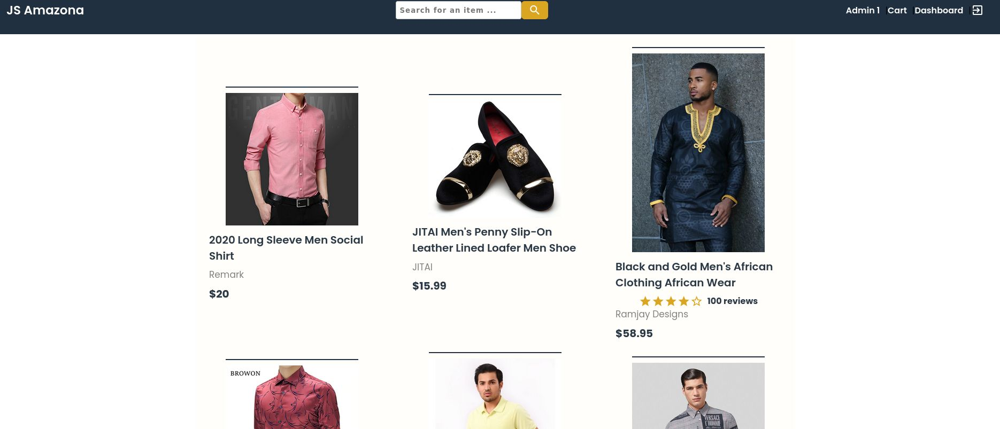

# JS Amazona

</img>

# Before you read

I took the idea of this project from this youtube tutorial: <a href="https://www.youtube.com/watch?v=N3FDyheHVMM&list=WL&index=46&t=81s">Link</a>. 
The instructor's code was not to my liking, a lot of "questionable" stuff being taught and not really being explained properly to beginners, which was the goal of the video. His video has 7 hours, and the complete project is available on <a src="https://www.youtube.com/watch?v=N3FDyheHVMM&list=WL&index=46&t=81s">Udemy</a>.

That being said, i'm just a student trying to make some projects.

On the frontend, i'm using these:

<a src="https://github.com/material-components/material-components-web">Material Components Web</a>
<a src="https://www.chartjs.org/">Chart.js</a>
<a src="https://sass-lang.com/">Sass</a>
<a src="https://webpack.js.org/">Webpack</a> to handle scss, bundling, etc.

My webpack.config.js is a mix between of what is being taught on the official webpack docs, and on the material component's.

On the backend, i'm using:

<a src="https://mongoosejs.com/">Mongoose</a>
<a src="https://www.npmjs.com/package/ts-node">ts-node</a>
<a src="https://www.npmjs.com/package/multer">Multer</a>
<a src="https://jwt.io/">jwt</a>

-----------------------------------------------------------------


<h3>About and running the front-end</h3>

This project is trying to make a SPA experience without using any frameworks. Why ? Making this actually gave me a lot of experience that i didnt have. Of course, it is not optimized and the code itself is messy. A lot.

I could have implemented MVC and other design patterns (i don't have much knowledge on design patterns for the frontend.), but i got lazy. Feel free to do it yourself.


-----------------------------------

The main file is **index.js**
It acts as the controller for loading the pages based on the current url. 


````
    ... code


const screen = routes[parseUrl] ? await routes[parseUrl]() 
    : await import('./scripts/pages/Error404').then(module => new module.default)


    ... rest of the code
```` 

**screen** is a variable that holds the page to be loaded, which is either a valid page, based on a valid url, or an error screen, which is displayed if the url does not match the one of the defined routes. These pages are being lazy loaded, with dynamic import.

So, if the current url is "/profile", the profile page will be assigned to the screen variable.


---------------------------------------


```` () => import('./scripts/pages/HomeScreen').then(module => new module.default) ````

As you can see, each page is a class that needs to be instantiated. I tried many diferent approaches to lazy loading, but came with this solution. Its not necessary to have the import inside a function. You can remove the arrow function and remove the brackets on "routes[parseUrl] ()  <<-- remove this" and it will work the same way.


Each page has two main methods, **render() and afterRender()**.

render() returns the html to be inserted on an html element, on this app, the element that holds the page's html is: ```` <section id="mainContent"></section> ````

afterRender() needs to be called after render() to be able to query the DOM and do some stuff with it. Usually, basic DOM manipulation, like hiding or showing something.


-----------------------------------------------------


Some pages requires an authenticated user, and/or be an admin to access it. On these cases, we have some functions that pushes the user to another page. 

An example:

```` 
async render(){
    if(!this.userInfo) return redirectUnauthenticatedUser() 

    ... rest of the code
}

````

userInfo is a getter, that holds the current logged user information, which is being kept on the local storage.
redirectUnauthenticatedUser() is a function that checks if the current user is authenticated (logged in), and redirects him to the main page if its not.

So, why am i checking again the user credentials with a conditional "(if ...)" when i'm already checking it on the redirectUnauthenticatedUser()?

Going back to the router() method, he have this piece of code:

```` 

if(screen.afterRender && typeof await screen.render() !== 'undefined') await screen.afterRender()

```` 

What this does is, i'm checking if the page has a afterRender method (some don't have, because they are not querying the DOM, but you could easily write an empty afterRender() on every page and remove the first conditional), and checking if the screen.render() method is not returning "undefined", if it is, the afterRender() method will not be called.

I'm pretty sure that some abstraction or a design pattern could be implemented to avoid codes like this, but since i don't really know how to do it, i'm gonna leave as it is.


-----------------------------------------


Install the dependencies.

```` npm run start-webpack ```` to run on development mode, which makes the bundling process runs faster.
```` npm run build ```` to run on "build" mode (minify css and js).


-----------------------------------


<h3>About and running the back-end</h3>

The backend is following the MVC pattern.
It is just your normal node api with typescript.

Create your mongo collection and make the changes to this code:

```` mongoose.connect("mongodb://localhost/jsamazona", ...}) ````

To create an admin user to test the dashboard page:

```` POST: http://localhost:3000/create-user, JSON: 
    {"name": "Admin 1",
	"email": "admin@admin.com",
	"password": "somethinghere123",
	"isAdmin": true}
```` 

I did implement the integration with paypal payments, but for testing only. It is probably bugged somehow, but works fine the majority of the time.

-----------------------------------------

Install the dependencies.

```` npm run dev ```` to run the server.


-----------------------

I'll probably mess with this project more, but for now it is in a good spot (kinda).

